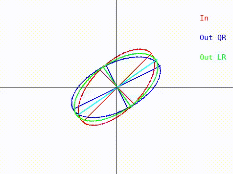

# Visualising algorithms on symmetric matrices

## Examples

### QR algorithm and LR algorithm

Here, we have a GIF animation of an interactive visualisation of the *QR* and *LR* algorithms for finding eigenvalues:

This depicts the result of *one iteration* of the algorithm in the form of a GIF animation. The ellipses denote *positive-definite symmetric matrices*. Such a representation by ellipses is possible because of the *spectral theorem*. Notice how the output is a *continuous function* of the input. Also notice how as the input matrix is rotated, it encounters two fixed points corresponding to its diagonalisations. One of these fixed points is stable, while the other is unstable.

The link to the Python code is [here](src/qr_lr.py). It uses Pygame and Numpy, and is very, very rough (as a minimum viable product should be). It would be better if it could run in a browser.

## Motivation

Many algorithms (like the QR algorithm for finding eigenvalues) are described in ways that are hard to understand. Specifically, it's unclear why these algorithms achieve their objectives. This is especially mysterious when the algorithms are based on fixed-point iteration, like the QR algorithm. In this repository, we hope to introduce *interactive visualisations* of linear algebra algorithms which should enable someone to understand how a given algorithm behaves when its inputs are varied.

## Details

The visualisations should be *interactive* wherever possible. The reason for this is that it allows someone to see how the output of an algorithm varies when its input is changed. This can enable someone to see how the input influences convergence rate.

A *positive-definite symmetric matrix* can be depicted as an ellipse in 2-dimensions, or an ellipsoid in 3-dimensions. Formally, this follows from the spectral theorem.

A *2x2* triangular matrix can be depicted as a 3D coordinate.

## TODO

-   Move away from Python into Javascript. This should enable interactivity in the browser.
-   Visualise QR algorithm with Wilkinson shifts. Each iteration is *discontinuous* as opposed to *continuous*. The input matrix should be depicted as an ellipse. The output matrix should be depicted as an ellipse.
-   Visualise Cholesky decomposition for *2x2* matrices. The input matrix should be depicted as an ellipse. The output triangular matrix should be depicted as a point in 3-dimensional space.
-   Visualise the Lanczos algorithm for *3x3* matrices. The input matrix should be depicted as an ellipsoid. What output would be useful is *to be determined*.